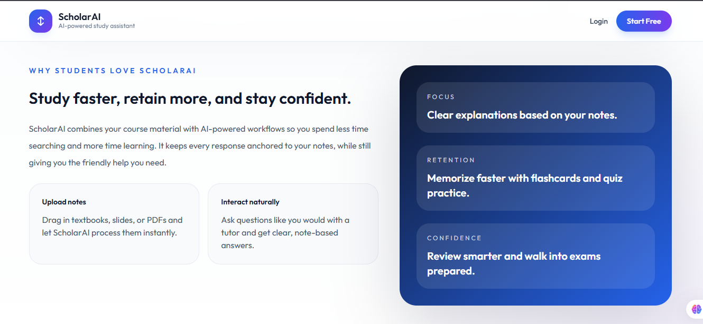
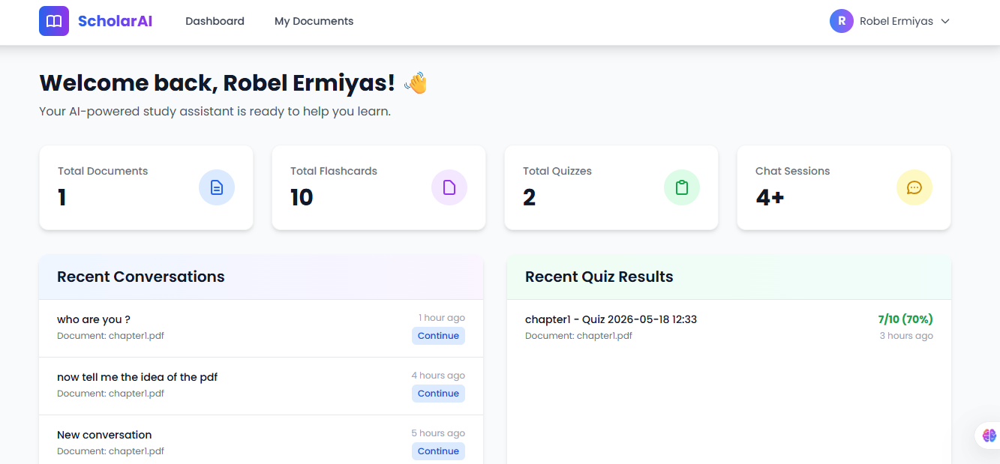
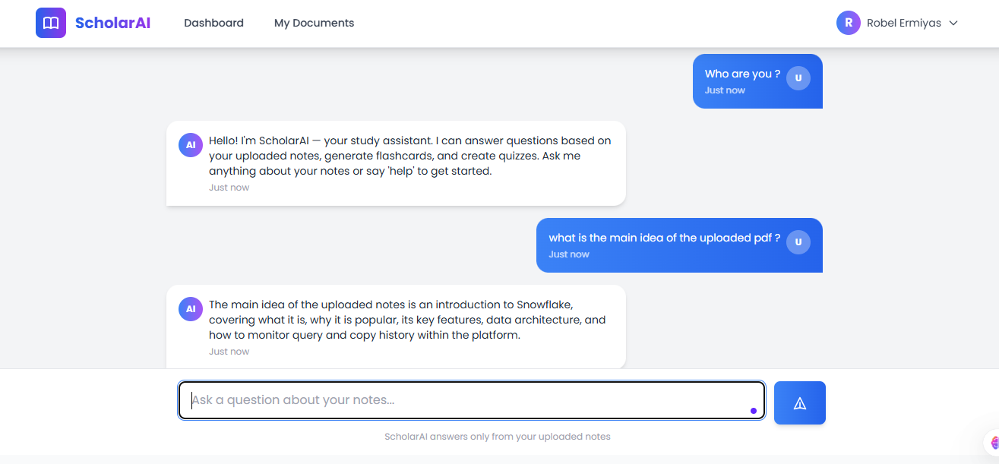
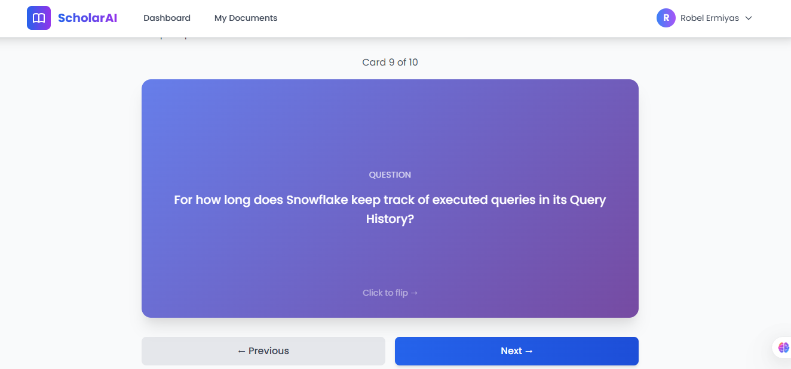
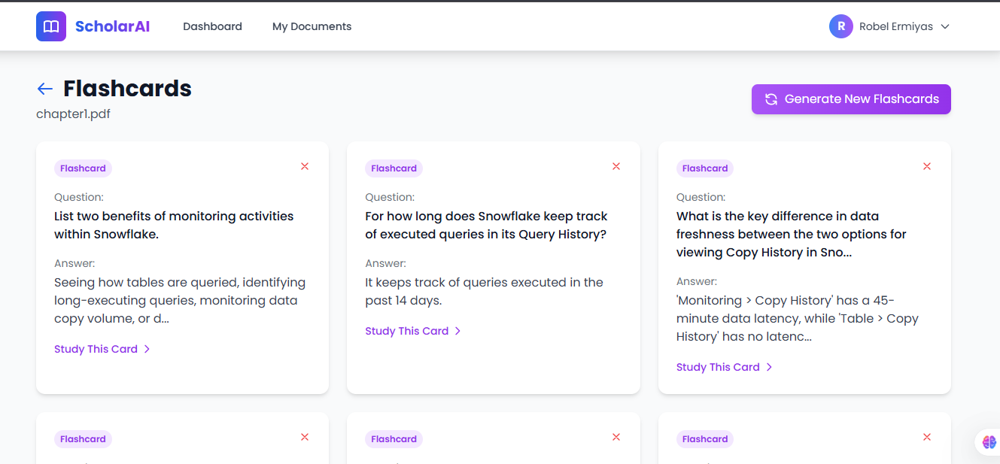
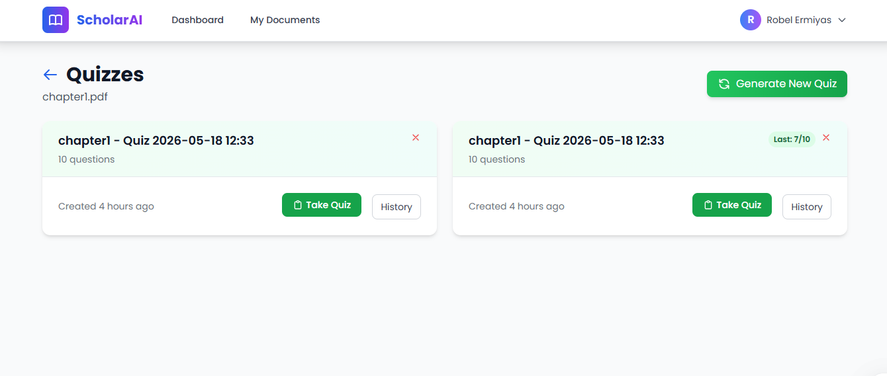
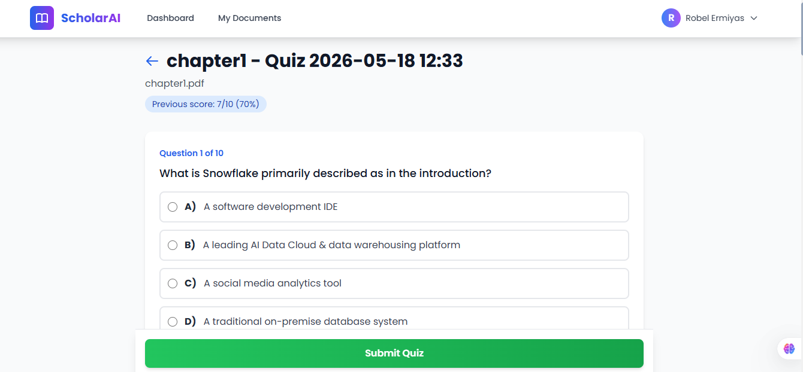
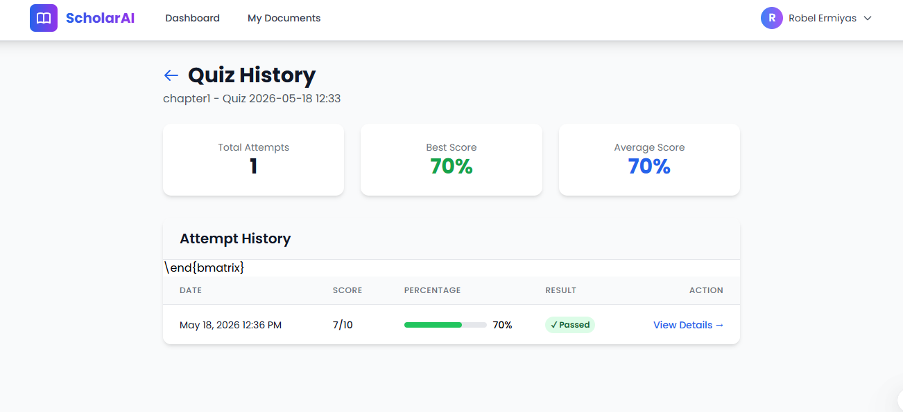

# ScholarAI - AI-Powered Study Assistant

## 📚 About The Project

ScholarAI is a full-stack web application that helps students study smarter using AI. Upload your lecture notes (PDFs) and get:

- 🤖 **AI Chat** - Ask questions and get answers based ONLY on your notes
- 🃏 **Flashcards** - Auto-generated study cards from your content
- 📝 **Quizzes** - Multiple-choice tests to check your knowledge
- 📊 **Dashboard** - Track your study progress

## 🛠️ Built With

- **Backend:** Laravel 11 (PHP 8.2+)
- **Frontend:** Blade Templates + Tailwind CSS
- **Database:** MySQL
- **AI:** Google Gemini API (Free Tier)
- **Queue:** Laravel Database Queue

## 🚀 Features

- ✅ User authentication (register/login/logout)
- ✅ PDF upload and processing
- ✅ RAG (Retrieval-Augmented Generation) with cosine similarity
- ✅ Persistent chat sessions with full history
- ✅ Automatic flashcard generation (10 per document)
- ✅ Automatic quiz generation (10 questions per quiz)
- ✅ Study dashboard with statistics
- ✅ Responsive design with Tailwind CSS

## 📸 Some Screenshots

### Landing Page



### Dashboard


### AI Chat Interface


### Flashcards



### Quiz Pages




## 📋 Prerequisites

- PHP 8.2 or higher
- Composer
- MySQL (via XAMPP)
- Node.js & NPM (for Tailwind CSS)
- Google Gemini API key

## 🔧 Installation

### 1. Clone the repository
```
git clone https://github.com/YOUR_USERNAME/ScholarAI.git
cd ScholarAI
```
### 2. Install PHP dependencies

```composer install```

### 3. Install NPM dependencies and compile assets
```
npm install
npm run build
```
### 4. Create environment file

```
cp .env.example .env
```
### 5. Generate application key

php artisan key:generate

### 6. Configure database in .env
```
DB_CONNECTION=mysql
DB_HOST=127.0.0.1
DB_PORT=3306
DB_DATABASE=scholarai
DB_USERNAME=root
DB_PASSWORD=
```
### 7. Add Gemini API key to .env

```
GEMINI_API_KEY=your_api_key_here
```

### 8. Run migrations
```
php artisan migrate
```

### 9. Create storage link
```
php artisan storage:link
```

### 10. Start the application

Terminal 1 - Laravel server
```
php artisan serve
```
Terminal 2 - Queue worker
```
php artisan queue:work
```
Terminal 3 - Vite (optional)
```
npm run dev
```
### 11. Visit http://127.0.0.1:8000

## 📄 License
This project is for educational purposes as part of Internet Programming II assignment.
